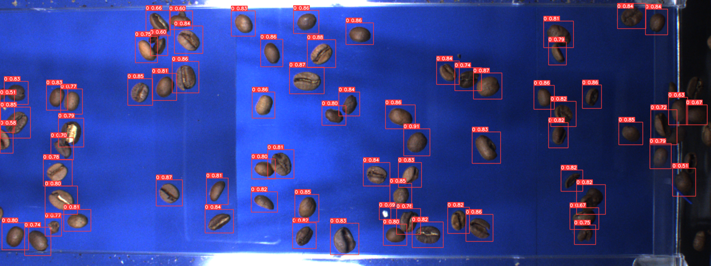

## 1. Introduction

The Sampi Sorter is a cutting-edge sorting machine designed to meet the diverse needs of the agricultural industry. It uses advanced image processing and artificial intelligence (AI) to classify agricultural products like grains, nuts, and dried fruits. By analyzing features such as size, shape, and color, the system separates products into "desired" and "undesired" categories.

This report highlights my contributions as the lead AI developer, focusing on optimizing the Sampi Sorter's detection and classification capabilities using computer vision and machine learning models. <a href="https://www.sorter.ir/en/" target="_blank">Project Website</a>

## 2. System Overview

The Sampi Sorter operates in multiple stages:

- 
<strong>Product Transport</strong>: Products are first moved via a conveyor belt, where contaminants like dust are removed.

- 
<strong>Image Capture</strong>: High-resolution images of the products are captured by cameras and sensors.

- 
<strong>AI Classification</strong>: AI algorithms analyze the images in real-time, classifying the products based on quality metrics.

- 
<strong>Separation</strong>: Sorted products are separated using air jets to minimize damage.

This system features non-destructive sorting, remote monitoring, and real-time performance reporting, ensuring enhanced efficiency and product quality.

## 3. Methodology

### 3.1. Detection with YOLOv8

A critical part of this project was developing an accurate detection model. YOLOv8, a state-of-the-art real-time object detection algorithm, was employed for its balance of speed and precision.

- 
<strong>Data Collection and Preprocessing</strong>: Images of agricultural products were captured under various conditions, creating a robust dataset. Augmentation techniques were used to improve model generalization.

- 
<strong>Model Training</strong>: The YOLOv8 architecture was optimized to detect objects with high efficiency and low computational overhead.

- 
<strong>Optimization</strong>: Fine-tuning was performed to reduce box loss and improve model accuracy.

The final model achieved a detection accuracy of <strong>99%</strong>, demonstrating its effectiveness in sorting agricultural products such as beans.

### 3.2. Classification with CNNs

After detection, convolutional neural networks (CNNs) were used to classify the products based on defects. Separate models were developed for each product type, such as lentils, cowpeas, and coffee beans.

- 
<strong>Architecture Design</strong>: The CNNs were designed to extract relevant features, such as broken kernels or discoloration, from product images.

- 
<strong>Training and Evaluation</strong>: The models were trained on labeled datasets and tested for generalization using unseen data.

- 
<strong>Optimization</strong>: Hyperparameter tuning helped improve classification accuracy and reduce errors.

These classifiers achieved high precision, ensuring accurate sorting based on product quality standards.

## 4. Results and Evaluation

The integration of AI into the Sampi Sorter resulted in significant improvements in performance:

- 
<strong>Detection</strong>: The YOLOv8 model achieved <strong>99%</strong> accuracy in detecting agricultural products, even under varied conditions.

- 
<strong>Classification</strong>: The CNN classifiers accurately categorized defects, ensuring that only high-quality products were selected.

These advancements have made the Sampi Sorter a highly efficient tool for real-time agricultural sorting, providing both accuracy and minimal product damage.

#### The Coffee Berry Borer, or Hypthenemus Hampei, is one of the most significant pest problems for coffee farmers.
 

#### Shell is a common defect where coffee beans have a large cavity similar to a shell.
 

## 5. Challenges and Solutions

During the development process, several challenges were encountered:

1. 
<strong>Data Variability</strong>: Variations in lighting and product positioning affected the model’s accuracy. To overcome this, extensive data augmentation was applied.

2. 
<strong>Hardware Constraints</strong>: The model needed optimization to run efficiently on available hardware without sacrificing performance. This was achieved by fine-tuning the YOLOv8 model and optimizing CNN architectures.

3. 
<strong>Defect Detection Accuracy</strong>: Detecting smaller defects, such as minor discoloration, proved challenging. The solution involved gathering a more diverse dataset and using more advanced data augmentation techniques.

## 6. Conclusion

The Sampi Sorter machine, powered by AI, is a highly effective tool for agricultural sorting, offering significant improvements in speed and accuracy. By utilizing YOLOv8 for detection and CNNs for classification, the system ensures efficient sorting of agricultural products with minimal damage.

This project demonstrates the transformative potential of AI in agriculture. Future work could involve expanding classification capabilities, improving defect detection, and increasing the range of agricultural products supported by the system.

